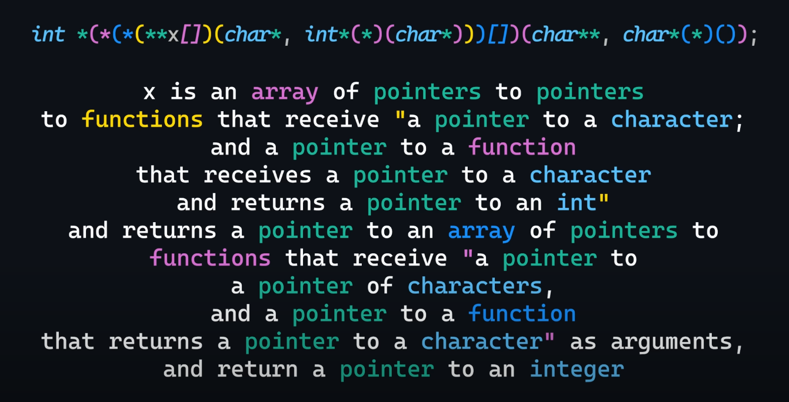

---

# 👾 Hey, I'm KlunnyS

```bash
$ whoami
> Newbie coder | Web developer in training | Always building
```

## 🚀 Currently

- 🌱 Learning **HTML · CSS · JavaScript**
- 🔭 Working on my first real web projects
- 💬 Ask me about anything — I'm figuring it out too!

## 🛠️ Tech stack


## 📊 Stats


## ⚡ Fun fact

Every expert was once a beginner. Let's build something cool.


<!--
**KlunnyS/KlunnyS** is a ✨ _special_ ✨ repository because its `README.md` (this file) appears on your GitHub profile.

Here are some ideas to get you started:

- 🔭 I’m currently working on ...
- 🌱 I’m currently learning ...
- 👯 I’m looking to collaborate on ...
- 🤔 I’m looking for help with ...
- 💬 Ask me about ...
- 📫 How to reach me: ...
- 😄 Pronouns: ...
- ⚡ Fun fact: ...
-->
